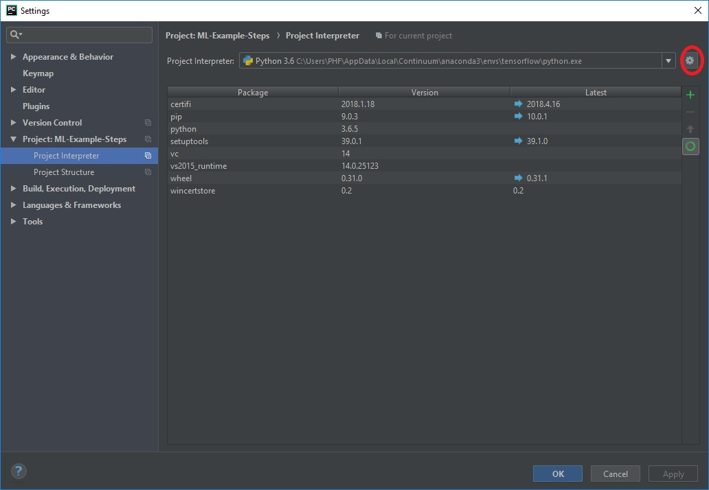

# Machine Learning Tutorial
This gives you the basic guidiance for what to do in the project. We have provided you with example projects for steps 3 to 5/6. Note that you will alyways have to do steps 0-2, to have your environment and data set up. Once you have setup your environment and data, feel free to copy the data to any downloaded project.

## Step 0 - Setup
Download and install Anaconda 3.6 Version from [Anaconda](https://www.anaconda.com/download/). When installing under Windows, make sure to check the "Add Anaconda to my PATH environment variable" and "Register Anaconda as my default Python 3.6". You may have to logout and login again, to be able to use the ``conda`` command. As an alternative, you can use the Anaconda Propmpt for the following commands.

If you are using Windows, you can install Tensorflow with the following commands. First create and activate an environment for Tensorflow with 
```
conda create -n tensorflow pip python=3.6
activate tensorflow
```
Conda environments are awesome, as they do not pollute your Python installation and you start from a clean environment. Then install Tensorflow with
```
pip install --ignore-installed --upgrade tensorflow
```
See [Tensorflow](https://www.tensorflow.org/install/) for details and for instructions on how to install Tensorflow on Ubuntu and Mac Os.
You also may want to install tensorflow-gpu, if you have a GPU. In that case, make sure to install ``tensorflow-gpu`` and also install the needed CUDA drivers.

Once you have installed Tensorflow, try to execute the following program:

```python
import tensorflow as tf

data = tf.constant([1, 2, 3, 4, 5, 6, 7, 8, 9, 10], dtype=tf.float32)
data = tf.reshape(data, shape=[1, 2, 5, 1])
pool = tf.layers.max_pooling2d(data, pool_size=[2, 2], strides=2, padding='same')

sess = tf.Session()
print(sess.run(pool))

```

Your output should be 
```
[[[[ 7.]
   [ 9.]
   [10.]]]]
```

You should use an IDE. I suggest using Pycharm, for me it is one of the best Python IDEs. To get the code either 
- clone the project, so you have the latest and completed version or 
- download the respective release and unzip it 

Then open this cloned or unzipped folder with Pycharm, see [here](https://www.jetbrains.com/help/pycharm/opening-reopening-and-closing-projects.html) for details on opening projects with Pycharm. In Pycharm you may have to add the newly created conda environment. To do so, run the command ``conda env list`` and note down the path to the newly created environment ``tensorflow``. In PyCharm go to File > Settings > Project: \[Project name\] > Project Interpreter.  Then click the icon highlighted in this image: 

Then select Conda Environment and Existing Environment. As path choose the previously noted path to the conda environment. You have to select an executable, so select the ``python.exe`` in this folder.


Install all the requirements listet in `requirements.txt`. If you use Pycharm, open the requirements.txt file. PyCharm will analyze your installed packages in the conda environment and suggest to install the missing packages. If you later on find some dependencies to be missing, feel free to install them.

## Step 1 - Download the data
You can either follow the steps described for Step 1 and 2, or you can download the images from the [release of Step 3](https://github.com/pfehrmann/ML-Example-Steps/releases/download/step-3/data.zip). In that case, download and extract the files.

Visit [Microsoft](https://www.microsoft.com/en-us/download/details.aspx?id=54765) and download the dataset. Unpack it to somwhere. You will have to move files from this directory in the next step.

## Step 2 - Training Data vs Test Data
You can do this step manually or use the ``util.py`` script provided. 

The dataset does not come with separated training and test data. The separation of these two types of data is crucial, so do that now. Create a directory structure like this:
```
.
+-- data
    +-- train
        +-- Cat
        +-- Dog
    +-- test
        +-- Cat
        +-- Dog
```      
Move into the folders under data/train the images with indices 0-9999 and move the images with indices from 10000-12500 to the test images.
This corresponds to 80% train data and 20% test data.

## Step 3 - Read the data
In order to learn from the data, you first have to pass this data to tensorflow. 
To do so, create a function that you can use as input_fn for the estimator. 
It should return cats and dogs similarily often, so don't have first only cats and then only dogs. 
The images should be randomly selected from all available training images. 
Also make sure, that this method is reusable: You will have to be able to use it for both the training and the test set.

## Step 4 - Create the neural net
We provided you with a rough framework, you manly have to fill in the blanks. 
Take a look at reference implementations of Estimators for the MNIST dataset. 
You can learn a lot from there.
Also consider using a highlevel wrapper, such as Keras for the creation of the net.
But if you just want to start playing around, the pure tensorflow code will be enough.

## Step 5 - Learn and evaluate the net
Now actually learn the net. But beware: There are so many hyperparameters, you will have your fun playing with these. You also may want to change the network architecture, as ours is not actually intended to win this competition :)

# Problems you will encounter
## Designing the input pipeline
This step is crucial. If you mess up here, things will be slower and, depending on your setup, by magnitudes slower.
See [here](https://www.tensorflow.org/performance/performance_guide#input_pipeline_optimization) for some quick tips.

## Image input
If you use the Tensorflow Dataset API, you will have to take special care of your input images. 
Some images may have a different format, than others, so you might want to do some preprocessing here. 
Maybe even external, to keep your code nice and clean.
There will also be very bad examples of images in the pipeline. 
Do you really want to include those? 
And more importantly: How do you find out, that an image is a bad example?
For example, look for images with the index 666. 
Here you may want to process images with another python script first and the either write them to the disk and use the input pipeline or use the images in RAM as input. 
This saves you from slow disk access.

## Long learning times
In case your learning takes forever, consider a few points:
- Is your net to huge? Having many Convolution Layers with large inputs will slow down things a lot. Also notice, that Tensorflow offers profiling tools, you might want to use them. There are many different architectures, that can cope with limited resources, e.g. SqueezeNet (this actually would run on a Raspberry Pi :) )
- Use Cloud Computing. If your computers hardware simply is not powerful enough, consider using cloud services. Take a look at FloydHub (easy to setup, 20h of CPU time for free) or AWS

## PyCharm
Although it generally is great, the scientific mode that comes with it, may break your code. If you see an error like ``Intel MKL FATAL ERROR: Cannot load mkl_intel_thread.dll.`` which disappears as soon as you run it in your console, you may want to disable the ``Show plots in tool window`` feature. See [here  for details](https://www.jetbrains.com/help/pycharm/matplotlib-support.html#sm).

# Things to try
Just a short list of things on my mind. Some relate to architecture others to preprocessing.
- Spatial Pyramid Pooling
- Global Max Pooling
- More Layers
- More Dense Layers
- More Filters
- Larger Filters
- Different Padding
- Image Augmentation
    - Rotation
    - Scaling
    - Noise
    - Cropping
    - Other distortions
- Grayscale images
- Only external preprocessing
- Cache images in RAM
